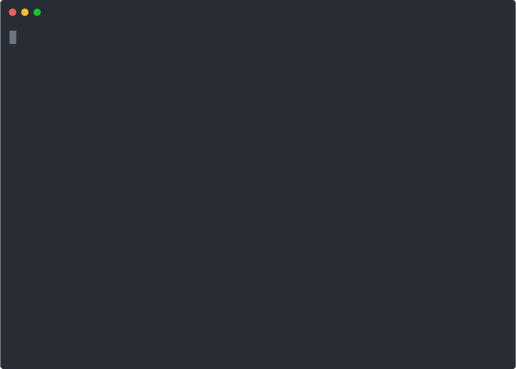

# `eckdanny`'s dotfiles

> My shell config, some `brew` CLI utils, and `npm`/`yarn` bits...



## Installation

```
git clone https://github.com/eckdanny/dotfiles.git ~/.dotfiles && cd $_ && source bootstrap.sh
```

then

```
~/brew.sh
```

### `ohmyzsh`

Update your `.zshrc` with the following after a fresh install

```diff
  # Would you like to use another custom folder than $ZSH/custom?
  # ZSH_CUSTOM=/path/to/new-custom-folder
+ ZSH_CUSTOM="/Users/deck/dotfiles/ohmyzsh"
```

then set the theme

```diff
- ZSH_THEME="robbyrussell"
+ ZSH_THEME="eckdanny"
```

head to plugins:

```diff
- plugins=(git)
+ plugins=(git tmux z docker docker-compose git-open)
```

`nvm`, `conda`, ... stuff in `.zshrc` ...

## Author

| ![alt][profile-pic] |
| :-----------------: |
|      Danny Eck      |

## Thanks/Credit

I had to do _very little_ to get my personal settings tracked thanks to:

- Mathias Bynens ([`dotfiles` repo][mathiasbynens-dotfiles])
- OhMyZsh ([website][ohmyzsh-site], [repo][ohmyzsh-github])

[profile-pic]: https://avatars2.githubusercontent.com/u/3521444?s=100&u=92031bc1bab5a65217f92776953473fa0f7650e8&v=4 "Profile Pic"
[mathiasbynens-dotfiles]: https://github.com/mathiasbynens/dotfiles "GitHub"
[ohmyzsh-github]: https://github.com/ohmyzsh/ohmyzsh "GitHub"
[ohmyzsh-site]: https://ohmyz.sh/ "Oh My Zsh"
